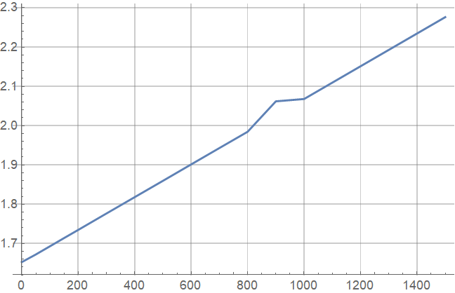
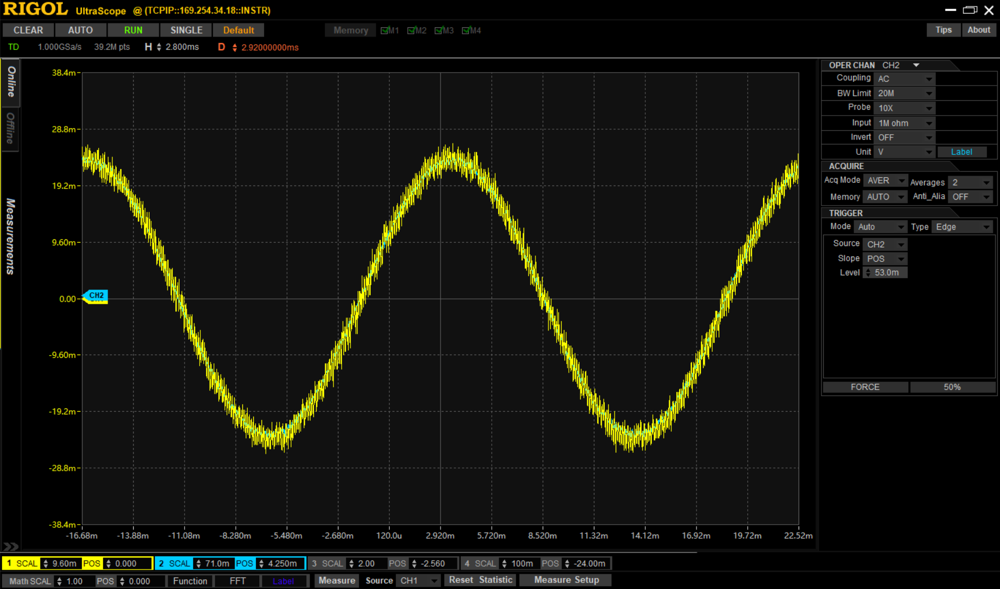

## AMC1301模拟隔离前端测试报告
1. 该模块使用AMC1301隔离放大器进行电流隔离测量。参照数据手册，AMC1301可提供高达5000VRMS的隔离保护，具体安全认证参见*7.7 Safety-Related Certifications*部分  

    部分关键参数如下  
    
    参数|min|typ|max
    :-|:-:|:-:|:- 
    增益||8.2|
    增益误差 | |±0.05%
    差模线性输入|-250mV||250m  
    差模输入阻抗||22kΩ|
    输入失调电压|||0.2mV
    THD||-87dB|
    供电|3.3V||5.0V

    
2. 模块使用两个1%精度的0.1Ω电阻并联作为采样电阻，以±250mV为输入电压范围，测量电流范围为±5A。高端电压信号放大8.2倍后，低端输出信号输入AD8605高精度运放，将参考电压调整至1.65V（该参考电压可由VREF引脚控制）。AD8605设置增益为1，系统总增益为8.2。  
   此外该模块使用SEPIC电路供电，推测为考虑隔离设计，使用EPA3582变压器隔离高低端电路，高端部分设有整流桥和LDO转换出3.3V电压提供给AMC1301。原理图未标明电源芯片型号，测量变压器低端输入信号是230kHz方波。不过实际设计应该可以简化。
3. 使用稳压电源测试：
   
   电流(mA) | 输出电压(V)
   :-:|:-:
   0|1.65281
   50|1.67230
   100|1.69311
   150|1.71396
   200|1.73474
   300|1.77649
   400|1.81815
   500|1.85966
   600|1.90139
   700|1.94308
   800|1.98450
   900|2.06200
   1000|2.06787
   1500|2.27626  

   

   要获得更大范围内的测试数据,考虑使用自动测量系统
   可见对直流信号的测量结果整体线性度较好，但在900mA处确实出现偏移，有必要进一步测试  

4. 使用信号源测试相位误差  

    

    输入50Hz正弦信号，无肉眼可见相差，隔离放大器相较电压/电流变压器在失真方面有明显优势  